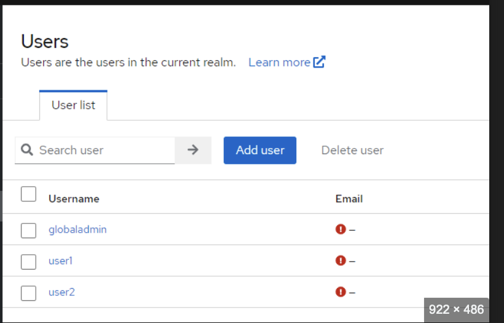

# Discussion on April 28th 2024

## Issues observed while getting data from Mirth

1. Users screen - Invalid date issue
2. Interfaces screen is empty even with right payload from Mirth
3. Admin screen -> Only tabs content should be scrollable.
4. [DONE] [Fix for DEMO] Admin page flow
   - [DONE] Each connector type has different form fields. (UX is clickable)
   - [DONE] This is applicable for both Source and Destination.
5. [DONE] [Fix for DEMO] Interfaces -> Source Port has all values as 0.0.0.0 - change it
6. [DONE] [Fix for DEMO] Increase the font size on left nav bar.
7. [DONE] [Fix for DEMO] Dashboard > 'System uptime' widget is not rendering properly.

## TODO:

1. [DONE] [Fix for DEMO] New tab in admin page: Scripts

   - [DONE] Should have channel selection first and once channel is selected, it should show the script content.
   - [DONE] Mimic mirth UI. refer screenshot (5:14pm)

2. [DONE] [Fix for DEMO] Admin page flow

   - [DONE] User should only have connector type selection
   - [DONE] Once user selects connector type, user should be redirected to the page with Source/Destiantion/Rules tab.

3. Come up with a way to switch real-time from mock data to mirth data.

4. [DONE] [Fix for DEMO] New Nav item - DICOM viewer.

   - [DONE] refer to https://github.com/OHIF/Viewers?tab=readme-ov-file
   - [DONE] Setup the OHIF viewer as a separate project and run it.
   - [DONE] temporarily, show OHIF viewer in an iframe in this new page
   - [DONE] Remove Neev logo from the OHIF viewer.

5. [DONE] [Fix for DEMO] Users page

   - [DONE] Add a new button to 'Add User' on the top right corner.
     - 
   - [DONE] Add a new button to 'Add Group' on the top right corner.
     - [Refer to this Groups API of Keycloak](https://wjw465150.gitbooks.io/keycloak-documentation/content/server_admin/topics/groups.html)

6. [DONE] [Fix for DEMO] Remove Reports page from the left nav bar.

7. [Fix for DEMO] Dashboard > Users activity widget should have an export option to download the report as a excel or csv.

8. [Fix for DEMO] Interfaces and Messages pages > Add an export option to download data as a excel or csv. [try to do the download functionality for the demo]
